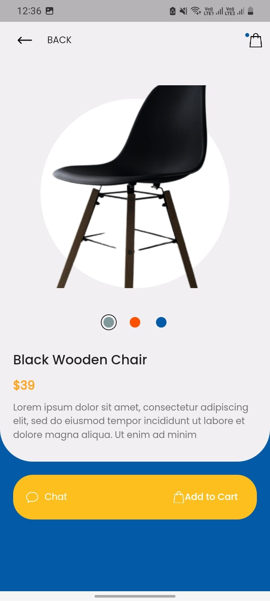

# Karostartup_assign

A new Flutter project.

## Getting Started

-----------------

This project is a my assignment for the position of Flutter Developer at KaroStartup.

## IMP note

-------------------
- I was not able to find API for the data, therefore I used static values which is present in [Products.dart](https://github.com/darkling10/karostartup_assign/blob/master/lib/resources/products.dart)
- If we find an API for this, only this file is needed to be changed

## App UI

-----------------

## Contact Details

-------------

[Email ID](mailto:pathan.abbas10@gmail.com)

[LinkedIn ID](https://www.linkedin.com/in/abbas-pathan-96b98b218/)

[Resume](https://drive.google.com/file/d/1QUOnfAP5LYmtHJDbN4i3aroXctK_8CJD/view?usp=sharing)
